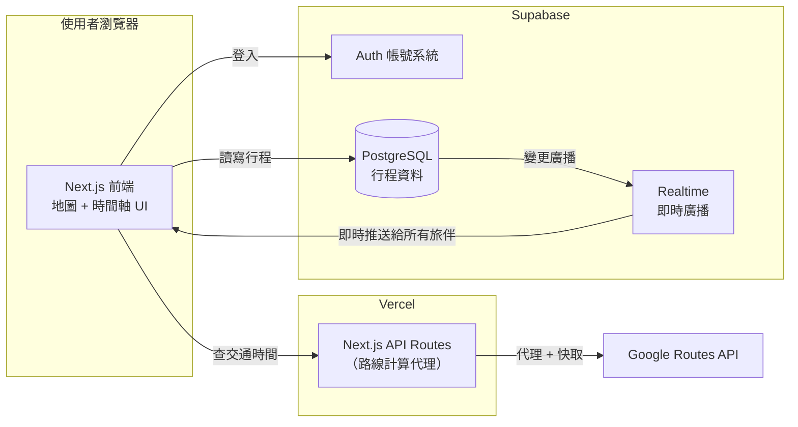
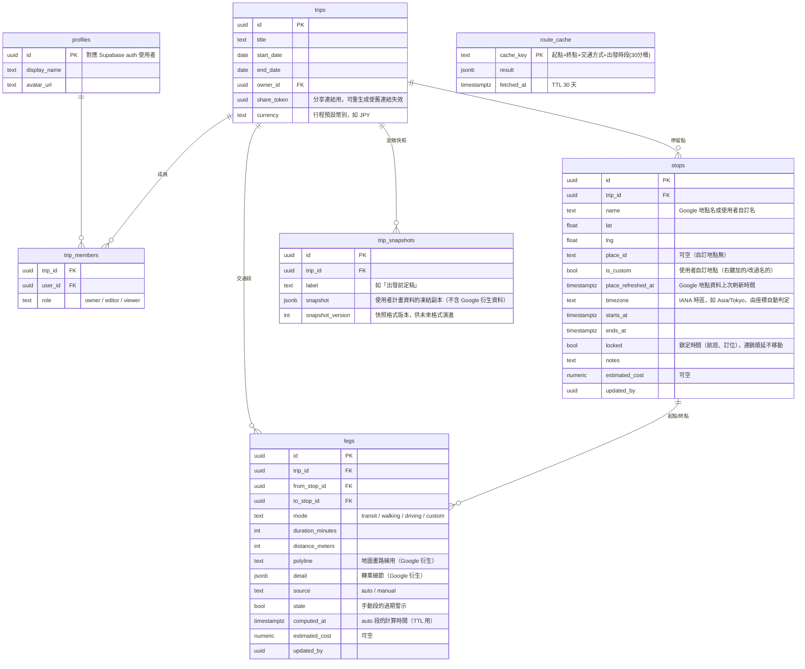
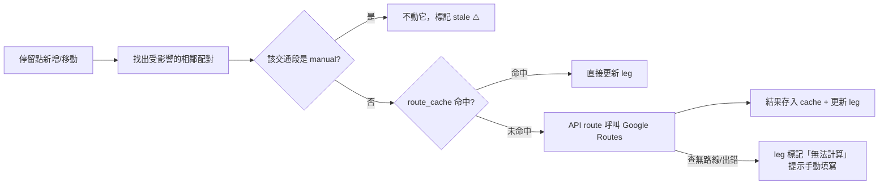

# 動態地圖行程規劃產品 — 設計文件

- 日期：2026-07-30
- 狀態：已與需求方逐段確認（架構、功能範圍、資料模型、互動設計、運作細節、合規修正）
- 專案名稱：travel-planner

## 1. 概述

把旅遊行程表從「表格」變成「時間 × 地圖」：使用者在互動地圖上規劃行程，透過時間軸滑桿看到自己什麼時間會在什麼地方、兩點之間用什麼交通方式、要移動多久。支援多人即時共同編輯，旅伴透過分享連結檢視。

原始構想包含「事前規劃」與「旅後回憶」兩大塊。本專案**只做事前規劃**；回憶功能（實際足跡、相簿、影片、社群串接）是未來的獨立專案，本專案透過「定稿快照 + JSON 匯出」為它預留資料接口。

## 2. 目標與非目標

### MVP 範圍

| 功能 | 本專案 MVP | 未來 |
|------|-----------|------|
| 地圖 × 時間軸行程編輯 | ✅ | |
| 多人即時共編（帳號系統、雲端儲存） | ✅ | |
| 交通自動計算 + 手動修正 | ✅ | |
| 分享連結（唯讀檢視，免註冊） | ✅ | |
| 行程預覽動畫（時間軸自動播放 + 鏡頭跟隨） | ✅ | |
| 預估花費（景點/交通可留空欄位 + 總覽） | ✅ | |
| 定稿快照 + JSON 匯出（為回憶專案鋪路） | ✅ | |
| 計畫 vs 實際對比 | | 回憶專案 |
| mp4 影片匯出 | | 回憶專案 |
| Excel（xlsx）行程表匯出 | | Plan 5（與 JSON 匯出同批；使用者 2026-07-31 提出。若行前急用，可於 Plan 3 後先出簡版——僅停留點欄位、無交通欄） |
| 照片 / 社群串接 | | 回憶專案 |
| 分帳結算（誰付誰欠） | | 不做（Splitwise 級的獨立產品，做了會失焦） |
| 離線編輯與合併 | | 不做（CRDT 級複雜度，MVP 不碰） |

### 產品定位決策

- **一開始就做成產品**：非個人工具，需要後端、帳號、雲端儲存。
- **全球通用**：不針對特定國家特化，交通資料依賴路線 API 的涵蓋範圍，缺口由手動修正接住。
- **Web 優先**：行前規劃適合大螢幕；分享連結免安裝是核心優勢。前端必為 TypeScript + React（互動地圖生態所在）。手機定位為「看得舒服、能小改」，重度編輯留給桌面。

### 預算功能的邊界（決策紀錄）

「預算」拆成兩半：**預估花費**（規劃階段的中性行程資訊，幫助旅伴對齊花費預期，該做）與**分帳結算**（記帳簿性質，傷感情也傷產品質感，不做）。UI 上花費是可留空的欄位，不填則隱形；總覽是角落的安靜數字。

## 3. 系統架構

技術選型：**方案 A — Next.js + Supabase**（曾評估：方案 B 全自建 Node + Postgres + Yjs CRDT，共編體驗天花板最高但開發量 2-3 倍；方案 C Firebase 全家桶，NoSQL 對行程資料建模彆扭。均否決）。

行程是結構化資料（景點、時間、交通段的列表），非自由文字文件。同步顆粒度做到「每個景點一列」，改不同景點天然不衝突，不需要完整 CRDT 就有足夠好的共編體驗——這是方案 A 成立的關鍵觀察。



| 元件 | 職責 |
|------|------|
| Next.js 前端（Vercel） | 產品主體：地圖畫布 + 時間軸滑桿 + 行程編輯面板。透過 Supabase 用戶端 SDK 直接讀寫與訂閱 |
| Supabase Auth | 註冊登入（Email + Google OAuth），不自行處理密碼 |
| PostgreSQL | 行程資料唯一真相來源，Row Level Security 在資料庫層控權限 |
| Supabase Realtime | 行程變更即時推送 + presence（旅伴在線） |
| Next.js API Routes | 唯一自寫後端：路線計算代理與快取（保護 API 金鑰、集中計費控制） |
| Google Maps 全家桶 | Maps JavaScript API（底圖）+ Places Autocomplete（地點搜尋）+ Routes API computeRoutes（TRANSIT / WALK / DRIVE 路線） |

### 地圖供應商選型（決策紀錄，經官方文件查證）

- Google 服務條款明文禁止把 Routes / Places 資料疊加在非 Google 地圖上（MapLibre / OSM 出局），2025 EEA 條款更嚴格。
- 全球大眾運輸路線計算無可行替代：Mapbox / TomTom 無 transit 產品；Transitland Routing API 僅美國 Beta；HERE 涵蓋清單無法確認；OpenTripPlanner 需自架自維護 GTFS，一人專案不現實。
- MapLibre 生態的圖磚服務（MapTiler / Stadia）免費層禁止商業使用。
- 計價（2025-03 改版後）：Maps JS 載入、Autocomplete、computeRoutes（純 TRANSIT 屬 Essentials 級）各自每月 10,000 次免費，超額約 $2.8–$7/千次。
- **結論：MVP 採 Google 全家桶。** 代價是綁定 Google 生態與視覺客製空間受限；換得唯一合規且全球可用的大眾運輸資料。
- Google TRANSIT 涵蓋為「運輸業者自願參與制」，官方無全球保證。涵蓋缺口由「查無路線 → 引導手動填寫」的設計接住，產品不會卡死。

## 4. 資料模型

七張表：`profiles`、`trips`、`trip_members`、`stops`、`legs`、`trip_snapshots`、`route_cache`。



### 關鍵設計決策

1. **時間用 UTC 儲存，每個停留點帶自己的 IANA 時區**（建立時由座標判定）。顯示一律轉當地時間（「當地時間 9:00 到淺草寺」）；時間軸在數學上是連續 UTC 軸，動畫與跨時區行程（台北→東京）都正確。
2. **交通段是獨立的表，不是即時推導**，因為它有自己的生命週期：
   - 停留點時間/順序變動時，受影響的 `auto` 段自動重算。
   - `manual` 段（使用者自填，如已查好的新幹線班次）**絕不被自動覆蓋**，改標 `stale = true`，UI 顯示「前後景點變動過，此交通資訊可能過期」。這是共編場景的保命符：旅伴 A 填的轉乘資訊不會因旅伴 B 挪動景點而默默消失。
3. **`route_cache` 與 `legs` 分離**：cache 全產品共用（任何人查過同一段交通，結果大家共用），legs 行程私有。外部 API 呼叫量隨產品成長的曲線因此平緩。
4. **權限收在 `trip_members` + RLS**，資料庫層三條規則：成員才能讀、editor 以上才能寫、viewer 唯讀。分享連結走 `trips.share_token`：免註冊唯讀，由伺服器端驗 token 供資料，token 可重生成。
5. **快照是一坨 JSON**：整份使用者計畫資料序列化凍結，不正規化、不做增量 diff。用途是回憶專案的對比資料源與誤刪救援；同一格式即 JSON 匯出格式，一魚兩吃。
6. **沒有 `days` 表**：「第幾天」由停留點當地日期推導，不另存。
7. **預估花費**：`stops` / `legs` 各一個可空 `estimated_cost`，幣別統一用 `trips.currency`（MVP 單一幣別，不做匯率換算）。總預估、每日預估、每人預估為衍生顯示，不落地。

### 資料所有權分層（Google ToS 合規架構）

經官方條款逐條查證（Service Specific Terms：Routes API §11.4、Places API §5.4、母條款 No Caching），Google 資料的儲存限制如下：

| 資料 | 條款允許 | 本設計的處理 |
|------|---------|-------------|
| `place_id` | 可永久儲存（建議 12 個月重新驗證，驗證呼叫免費） | 永久欄位；`place_refreshed_at` 超過期限時背景刷新 |
| 經緯度 | 快取上限 30 個連續日曆天 | 視為可重建快取，隨地點資料刷新 |
| 地點名稱、地址 | 無明文允許長期儲存（灰色地帶） | 同上，用 place_id 定期重拉覆蓋；使用者自訂地點（`is_custom`）不受限 |
| 路線結果（duration / distance / polyline / 轉乘細節） | 無任何明文允許長期儲存（風險最高） | `auto` 段 TTL 30 天（`computed_at`），過期後行程被開啟時背景重算；`manual` 段為使用者資料，永久 |

**核心原則：資料庫的永久真相 = place_id + 使用者自己的資料；一切 Google 衍生資料 = 30 天內有效的可重建快取。**

由此推導的重要性質：

- 使用者排定的時間表（10:00 離開淺草寺、10:42 抵達晴空塔）是使用者的計畫資料，永久保存——「移動花多久」已隱含其中，未來回顧的核心資訊一件不丟。
- **快照只凍結使用者計畫資料**（place_id、自訂名稱、時間、備註、花費、交通方式、manual 段全文），不凍結 Google 的 polyline 與轉乘原始資料。「計畫 vs 實際」對比不受影響。
- 若某段轉乘細節對使用者特別重要（已據此買票），引導填入 manual 段收為己有。
- 這個分層同時降低了未來更換路線供應商的成本——Google 資料從來不是真相來源。

**殘留合規風險（誠實記載）**：「30 天 TTL 快取」貼近條款「暫時性效能快取」例外的字面，但該例外立法目的是網路延遲而非成本節約，屬善意解讀而非保證合規。條款違規的常見執法是整個 API 專案停權。**產品正式商用前，應透過 Google 業務窗口書面確認此使用情境**（Enterprise 合約可談客製資料保留條款）。個人使用與早期開發階段風險極低。

## 5. 地圖 × 時間軸互動設計

### 畫面佈局（桌面優先）

```
┌─────────────────────────────────────────────────────────┐
│ ◀ 東京五日遊        👤👤👤 旅伴在線    [分享] [出發!]  │
├──────────────┬──────────────────────────────────────────┤
│ 行程清單面板  │                                          │
│ (可收合)     │              地  圖                      │
│ ┌──────────┐ │      (景點標記 + 路線線條 +              │
│ │09:00 淺草寺│ │       目前時刻的「我」標記)               │
│ │ ¥0 · 90分 │ │                                          │
│ └──────────┘ │                                          │
│ 🚇 12分 ¥180 │                                          │
│ ┌──────────┐ │                                          │
│ │10:42 晴空塔│ │                                          │
│ └──────────┘ │                                          │
├──────────────┴──────────────────────────────────────────┤
│ Day1 Day2 Day3 Day4 Day5                    [▶ 播放]     │
│ ██淺草寺██──🚇──███晴空塔███──🚶──██午餐██   ← 時間軸    │
│              ▲ 播放頭（可拖動）                           │
└─────────────────────────────────────────────────────────┘
```

地圖全螢幕背景、清單面板浮左可收合、時間軸固定在底。三者完全聯動：點任何一邊，另外兩邊跟著捲動、高亮、移動鏡頭。

### 時間軸機制

- 橫軸是時間。停留點是色塊（長度＝停留時間），色塊之間是交通段連接條（🚇🚶🚗 圖示區分）。Day 分頁 + 「整趟總覽 ↔ 單日放大」縮放。
- **拖動播放頭**：地圖上「我」的標記即時反應——停留時段在景點上；交通時段沿路線線條按時間比例插值移動。
- **播放模式**：播放頭自動前進、鏡頭跟隨（＝行程預覽動畫）。與拖動滑桿共用同一套機制。分享連結打開預設進播放模式。播放同時是規劃檢查工具（「這樣跑會不會太趕」用看的就知道）。

### 編輯互動

- **加景點**：搜尋框（Places Autocomplete）→ 落地圖 + 插入當天時間軸尾端 → 拖到想要的位置。地圖任意點右鍵「加入行程」＝自訂地點後門（接住 Google 未收錄地點與運輸涵蓋缺口）。
- **調時間**：時間軸直接拖。拖色塊邊緣＝改停留長短；拖整塊＝改開始時間。
- **時間連鎖（核心痛點設計）**：插入或延長時，後續行程**預設自動順延**；個別停留點可設「🔒 鎖定時間」（訂位餐廳、航班、展演場次），鎖定點不動；順延撞上鎖定點時亮紅色警示（「空檔 20 分但交通要 35 分」）讓人取捨。
- **交通段**：相鄰停留點間自動出現；點開可切換交通方式、看轉乘細節、手動修正（manual/stale 規則見 §4）。

### 共編即時回饋

旅伴頭像在頂欄（presence）；他人改動時被改的卡片短暫高亮 + 「小明剛把午餐改到 12:30」。輕量路線，不做游標級 presence（方案 A 顆粒度下的自然選擇）。

### 警示但不阻擋

規劃過程常有暫時混亂（時間重疊、趕不上），一律**紅色警示但不阻止操作**。「趕不上」偵測（空檔 < 交通時間）是本產品相對表格工具的核心價值。

### 手機

響應式做唯讀檢視 + 簡單編輯（改時間、改備註）；拖拉式時間軸編輯不塞進小螢幕。

## 6. 運作細節

### 即時共編同步

- 開行程頁即訂閱該行程的 Realtime 頻道（`stops` / `legs` / `trips` 的變更 + presence）。
- 寫入路徑：樂觀更新本地 → 寫 Postgres → 廣播 → 旅伴更新。每列帶 `updated_by` 供顯示歸屬。
- 衝突＝列級後寫者贏，配合「manual 段絕不被自動覆蓋」規則。
- **時間連鎖順延必須原子化**：做成 Postgres 函式（RPC），一次交易完成所有時間移動，旅伴收到完整變更組，不會看到改到一半的中間狀態。這是共編設計唯一需要特別小心處。
- 斷線：橫幅提示 + 暫停編輯；重連後整份行程重新抓取。不做離線編輯合併。

### 交通計算與快取生命週期



- 快取鍵＝起點座標＋終點座標＋交通方式＋出發時段（30 分鐘桶——transit 結果與出發時間相關，30 分是失真與失效的折衷）。
- 重算由做出編輯者的請求觸發，旅伴只接收結果（避免多人同開重複呼叫）。
- `route_cache` TTL＝30 天（條款上限）；`auto` legs 過期後在行程被開啟時背景重算。TTL 為設定值，調整不動架構。
- 成本護欄：路線代理 API 要求登入 + 按使用者限流（防止端點被當免費 Google 代理刷爆帳單）。

### 錯誤處理

原則：**外部服務的任何失敗都不能阻止使用者繼續編輯行程。**

| 失敗情境 | 行為 |
|---------|------|
| Google 查無大眾運輸路線（涵蓋缺口） | 交通段顯示「查無路線」，一鍵切手動填寫或改走路/開車 |
| Google API 額度爆掉 / 暫時故障 | 交通段標「待計算」可重試；行程編輯完全不受影響 |
| Realtime 斷線 | 橫幅提示 + 暫停編輯，重連自動恢復 |
| 分享 token 已被重生成 | 明確的「連結已失效」頁 |

### 測試策略

刻意的架構安排：**時間連鎖順延、快取鍵生成、時區換算、預算加總全部寫成純函式**（不碰資料庫與網路），窮盡單元測試，為 TDD 主戰場。其餘分層：

- 整合測試：RLS 權限規則（本地 Supabase 實測：成員能讀、非成員被拒、viewer 不能寫）、路線代理 API（mock Google）、連鎖 RPC 原子性。
- E2E（Playwright）：建行程 → 加景點 → 交通自動出現 → 分享連結唯讀檢視；雙瀏覽器即時同步冒煙測試。
- 地圖/時間軸互動：元件測試 + E2E 核心流程，不對拖拉行為做像素級測試。
- 覆蓋率目標 80%。

### 部署與環境

- Vercel（前端 + API routes）+ Supabase 雲端；本地開發用 Supabase CLI。
- 所有金鑰進 `.env` 並列入 `.gitignore`；Google API 金鑰僅存在伺服器端。

## 7. 為回憶專案預留的接口

1. **定稿快照**：按「出發！」時凍結整份使用者計畫資料。若無快照，出發前的原計畫會被持續編輯覆蓋，「計畫 vs 實際」將永遠做不出來——成本一張表，不做以後會後悔。
2. **JSON 匯出 / API**：快照格式即匯出格式，回憶專案（或任何第三方）可直接讀取完整行程。
3. 未來對比素材天然成套：計畫 vs 實際「路線」（快照 vs 照片 EXIF / 足跡）＋預算 vs 實際「花費」。

## 8. 殘留風險與待辦決策

| 項目 | 說明 | 處理時機 |
|------|------|---------|
| Google 快取條款解讀 | 30 天 TTL 為善意解讀非保證合規；違規後果是專案停權 | 商用前透過 Google 業務窗口書面確認 |
| TRANSIT 涵蓋缺口 | 官方無全球保證，新興地區二三線城市可能查無路線 | 已由手動修正設計接住；上線前對目標市場抽樣實測 |
| API 費用隨規模成長 | 三個 SKU 各 10,000 次/月免費，超額 $2.8–$7/千次 | 快取 + 限流已設計；成長期監控帳單 |
| 產品命名 | 已定 travel-planner（GitHub repo 名）；對外品牌名可再議 | 上線前 |
| 帳號刪除語義 | trips.owner_id 為 on delete set null：owner 刪帳號後行程保留給其他成員，無 owner 的行程暫無人可管理（轉移擁有權功能屬後續迭代） | 共編功能上線前 |
| updated_by / created_by 無 FK | 使用者刪除後這些欄位殘留孤兒 uuid，UI 需 fallback 顯示「已離開的成員」 | Plan 3 UI 實作時 |
| Realtime DELETE 事件不套 RLS | Supabase 官方行為：DELETE 廣播給所有訂閱者（payload 僅剩 PK），client 須以「本地有此 id 才移除」冪等處理，且不可依賴 payload 中的 trip_id | Plan 5 共編實作時 |
| 本機 supabase db reset 故障 | CLI 2.110.0 報 LegacyDbBootstrapError；本機重建 schema 的替代指令：drop schema public cascade 後以 psql 重跑 migration | CLI 修復後移除 workaround |
| Plan 2 開工前清理批次 | 最終審查遺留項：Google 登入按鈕在未設定 provider 時必失敗（藏按鈕或補 config stub）、OAuth redirect 允許清單與 README host 不一致、UI 層零自動化測試（補 Playwright smoke）、以及 11 個 Minor（title 驗證、清單分頁、錯誤訊息通用化、深色模式按鈕、layout metadata/lang、登出入口、profiles 可列舉範圍等，詳見最終審查報告） | Plan 2 開工前 |
| Playwright reuseExistingServer 寫死 true | 導入 CI 時需改為 !process.env.CI 並評估 retries/trace，否則 CI 可能對過期 server 跑出假綠燈 | 導入 CI 時 |
| E2E 清理的 listUsers 未分頁 | 測試使用者清理只掃第一頁，規模大後可能漏清（不會誤刪，只會少清） | 測試量成長時 |
| stops 批次寫入的 advisory lock 約束 | 任何對 stops 的多列批次 UPDATE 必須先取 pg_advisory_xact_lock(hashtextextended(trip_id::text,0))（已寫入表註解），否則與 cascade_shift_stops 併發會 deadlock；單列 UPDATE 不受限 | 每次新增 stops 批次寫入時 |
| cascade RPC 的 delta 單位契約 | 參數為「秒」，client 呼叫端必須 Math.round(deltaMs/1000) 明確換算並註解——366 天上限只能攔千倍級災難值，分鐘級的 ms 誤傳仍會靜默造成 10-42 天跳動 | Plan 3 Task 6 接線與其後每個新 caller |
| 跨午夜停留點僅顯示於開始日 | 23:00–01:00 的停留點只出現在開始日的側欄/時間軸，結束日無延續視覺、當日衝突偵測亦不涵蓋其尾段 | 時間軸後續迭代 |
